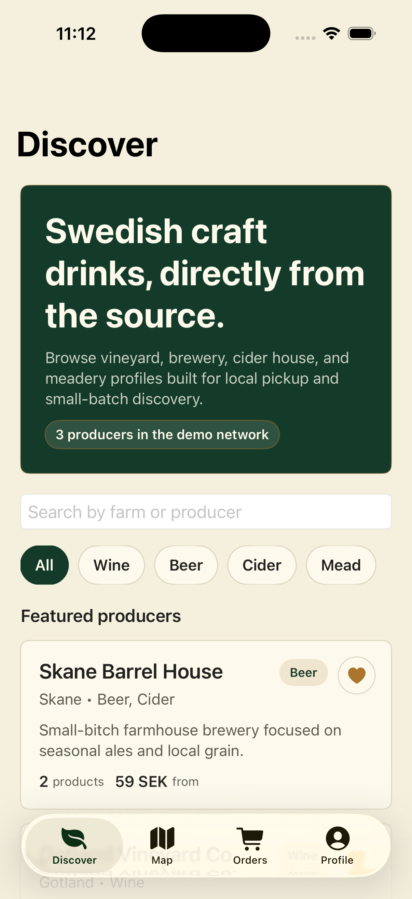
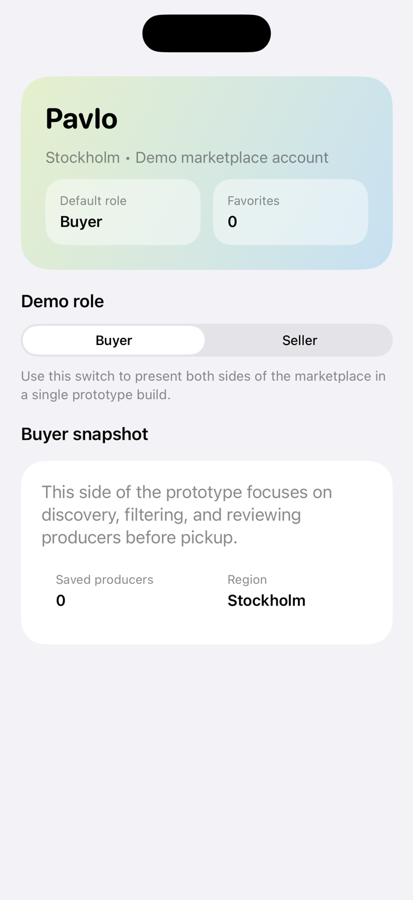
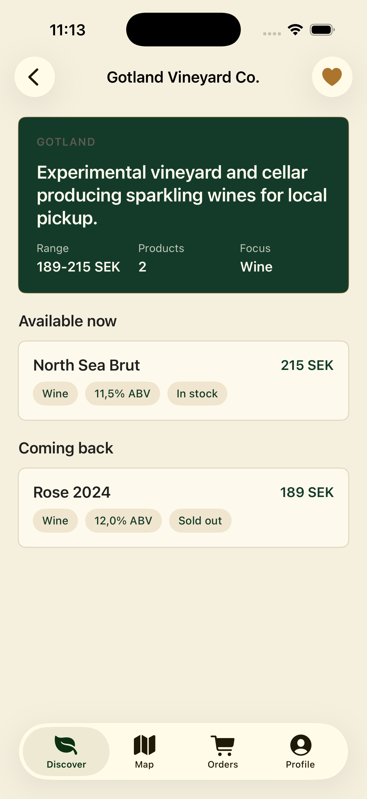

# Gardsnatet

SwiftUI prototype for a Swedish farm-to-consumer marketplace focused on small-scale wine, beer, cider, and mead producers.

The app explores a two-sided marketplace where buyers can discover local producers and sellers can manage limited inventory and pickup-based fulfillment.

## Screens

| Discover | Profile / Seller Mode | Producer Detail |
| --- | --- | --- |
|  |  |  |

## What It Demonstrates

- Feature-oriented SwiftUI app structure using `App`, `Core`, and `Features`
- Basic MVVM setup with dedicated view models per screen
- Shared app environment with mock services for prototype-friendly data flow
- Buyer flow for discovery, map browsing, order overview, and producer details
- Seller-facing dashboard concept inside the profile flow

## Architecture

### App

- `App/`
- App entry point, root tabs, and environment composition

### Core

- `Core/Models`
- Marketplace domain models such as `Producer`, `Product`, `Order`, and seller dashboard types

- `Core/Services`
- Service protocols plus mock implementations used by the prototype

- `Core/Support`
- Shared utility types such as `LoadState`

### Features

- `Features/Discover`
- Discovery feed, filters, and producer cards

- `Features/Map`
- Map browsing and producer selection

- `Features/Orders`
- Order list and status overview

- `Features/ProducerDetail`
- Producer story, pricing range, and product availability

- `Features/Profile`
- Buyer profile plus demo seller dashboard mode

## Current Product Direction

This prototype is centered on:

- Small-batch Swedish producers
- Local discovery and regional browsing
- Pickup-first ordering rather than large-scale fulfillment
- A single demo build that can present both buyer and seller perspectives

## Running The Project

1. Open `Gardsnatet.xcodeproj` in Xcode.
2. Select an iPhone simulator.
3. Build and run the `Gardsnatet` scheme.

The app currently uses mock data only. No backend setup is required.

## Testing

- Unit tests live in `GardsnatetTests`
- The current test coverage is intentionally light and focused on view model filtering logic

## Roadmap

- Add producer favorites and persistent saved state
- Expand seller tools with inventory editing and pickup window management
- Replace mock services with local JSON or a real backend layer
- Add richer tests for view models and core flows
- Update the map implementation to newer iOS 17+ `Map` APIs

## Notes

This repo is intentionally positioned as a portfolio prototype rather than a production-ready marketplace app. The goal is to show product thinking, SwiftUI structure, and a clean path for iterative expansion.
